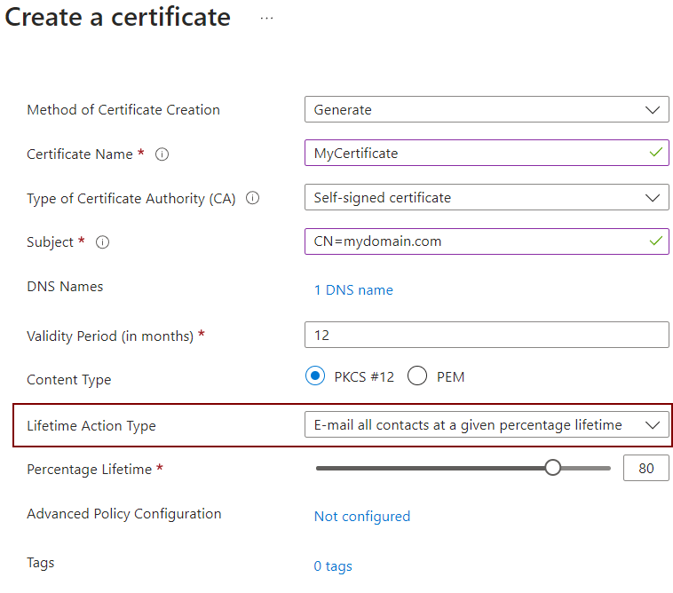

# Key Vaults
Azure Key Vault allows the secure storage of three types of securable object: `Secrets`, `Keys` and `Certificates`.

## Best Practice #1: Use RBAC instead of Access Policies
Key vaults can be configured to authorise requests using one of two security models: RBAC or access policies.

RBAC is recommended by Microsoft as it allows roles to be assigned at a much finer-grained level, even on individual secrets, keys and certificates if necessary. Not only this, but it also integrates well with Entra ID's Privileged Identity Management (PIM) feature, allowing users to temporarily elevate their permissions, with approval gates, when they need to see the values of specific secrets.

Access policies, on the other hand, only provide the ability to grant access to _all_ secrets, keys or certificates. And access cannot be revoked automatically after specific period of time.

## Best Practice #2: Always set expiry dates
Secrets and keys in Azure Key Vaults have an optional expiry date field. It is optional because secrets and keys often have no in-built expiry mechanism (like PKI certificates do). However, despite this, it is recommended to always set an expiry date on the key vault objects to ensure that they are periodically rotated in line with security best practices.

## Best Practice #3: Automatically rotate/renew secrets, keys & certificates
Ideally, development teams would put automatic rotation policies in place so that these objects can never accidentally expire. Azure key vaults have a native capability to do this for keys and certificates, but developments teams are likely to have to create something custom to do the same for secrets.

## Best Practice #4: Send alerts prior to expiration
For less mature teams that are unable to automatically rotate/renew secrets, keys & certificates, a more manual aopproach is to ensure that alerts are raised before any secret, key or certificate is due to expire.

### Native Key Vault Certificate Alerts
Azure Key Vaults have a native capability that can send emails to a list of specified contacts when certain "lifecycle events" occur. Such lifecycle events include a certificate nearing expiry and a certificate expiring.

To enable these emails, first define the list of "Contact" email addresses that should be alerted when certificate reaches a lifetime event and then update each certificate to specify the appropriate "lifetime action" that should be taken:



Alert emails can be sent to all contacts after a specific percentage of the certificate lifetime has elapsed, or a specific number of days prior to the certificate expiry date.

### Custom Alerts
Key Vaults have no native capability to raise alerts when secrets and keys are nearing expiry. However, Key Vaults can raise _events_ whenever a key vault object...
- is created
- is updated
- is deleted
- is due to expire in 30 days
- has expired.

Therefore, to ensure that the required alerts are sent, we simply need to create an Azure System Event Grid Topic for the key vault to send those events to and then create an Azure Event Subscription to receive the "NearExpiry" and "Expired" events from that topic. The Event Subscription would then trigger an Azure Monitor Action Group, which would be preconfigured to alert the team members via email/SMS/push notification/etc.

The following snippet shows how this can be achieved in a bicep template:

```bicep
// Create an action group that will send out email alerts
resource action_group 'Microsoft.Insights/actionGroups@2023-01-01' = {
  name: '${ProductName}-${EnvironmentCode}-ac-operations'
  location: 'Global'
  properties: {
    groupShortName: '${ProductName}${EnvironmentCode}'
    enabled: true
    emailReceivers: [
      {
        name: '${ProductName}_${EnvironmentCode}_Operations'
        emailAddress: AlertEmailAddress
        useCommonAlertSchema: true
      }
    ]
  }
}

// Create the Key Vault
resource key_vault 'Microsoft.KeyVault/vaults@2024-11-01' = {
  name: '${ProductName}-{EnvironmentCode}-kv'
  ...
}

// Create the system topic to which the Key Vault will send events
resource key_vault_system_topic 'Microsoft.EventGrid/systemTopics@2022-06-15' = {
  name: '${ProductName}-${EnvironmentCode}-kv-evgst'
  properties: {
    source: key_vault.id
    topicType: 'Microsoft.KeyVault.Vaults'
  }
  identity: {
    type: 'SystemAssigned'
  }
}

// Create a subscription to the system topic
// Note: We currently need to use the preview apiVersion in order to have access to the "MonitorAlert" destination endpoint type.
resource key_vault_event_subscription 'Microsoft.EventGrid/systemTopics/eventSubscriptions@2024-06-01-preview' = {
  name: 'KeyVaultObjectExpiration'
  parent: key_vault_system_topic
  properties: {
    eventDeliverySchema: 'CloudEventSchemaV1_0'
    filter: {
      // Only send the "NearExpiry" or "Expired" events to the ActionGroup
      includedEventTypes: [
        'Microsoft.KeyVault.CertificateNearExpiry'
        'Microsoft.KeyVault.CertificateExpired'
        'Microsoft.KeyVault.KeyNearExpiry'
        'Microsoft.KeyVault.KeyExpired'
        'Microsoft.KeyVault.SecretNearExpiry'
        'Microsoft.KeyVault.SecretExpired'
      ]
    }
    destination: {
      endpointType: 'MonitorAlert'
      properties: {
        severity: 'Sev0'
        actionGroups: [action_group.id]
      }
    }
  }
}
```
