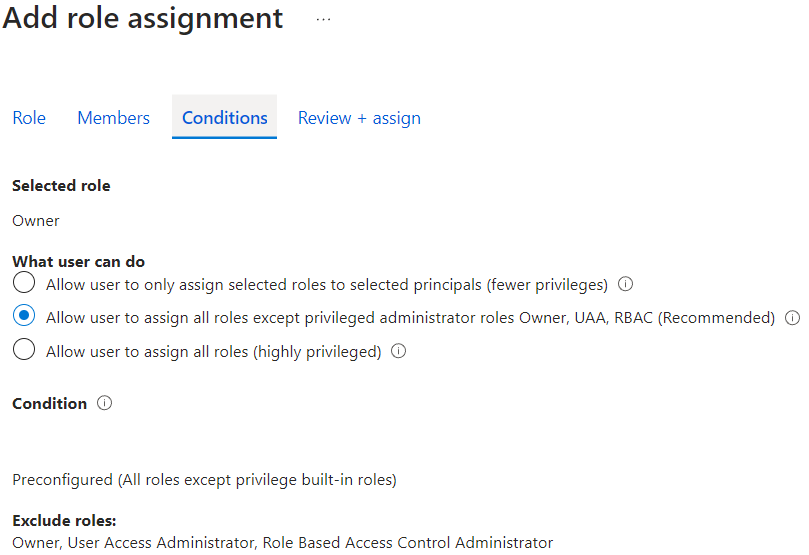

# Azure Role Assignments

## Best Practice #1: Don't assign roles to users directly
Roles should only be assigned to groups and service principals.

## Best Practice #2: Give product team groups read access to all of their environments
The product teams will need to be able to monitor their applications and diagnose issues, even in the production environment.

## Best Practice #3: Do not give _anyone_ permanent write access over production environments
Teams should use their CI/CD pipelines to make changes to production. This way, their changes will be subject to all the normal review and quality gates, giving confidence that the change will work in production.

## Best Practice #4: Do not give product team groups read access to production secrets
Environmental secrets, keys and certificates are the only real line of defence against bad actors, which could include rogue developers. Anyone that gains access to production secrets could act as if they were the production applications, which will usually give them write permissions to various parts of the environment (effectively bypassing their read-only role).

## Best Practice #5: Allow product team members to temporarily elevate their access to their production environment
In the event of an emergency "break-glass" situation, product team members should use Privileged Identity Management (PIM) to temporarily elevate themselves into a highly privileged role.

This should be a very rare occurrance, only to be used when delay is considered risker than allowing a developer to make manual changes to the production environment, bypassing all of the quality gates imposed by the CI/CD pipeline. An example might be to allow a developer to manually update an expired secret that has caused the whole application to go down in production.

## Best Practice #6: Assign roles to product teams at a high-level, environmental scope
Users are unpredictable and curious creatures who will often explore the boundaries of the system. This is useful behaviour and should not be discouraged. Such exploration is often the reason that bugs and security holes are discovered, as well as being a useful onboarding mechanism for new team members. As such, you want users to be able to explore the entirety of their own environments, so you should apply roles at that level.

## Best Practice #7: Assign roles to applications' managed identities at the lowest possible scopes
Any given version of the application is completely predictable as it only has a finite number of features. Therefore, there will be no need to change role assignments outside of the normal CI/CD process. As such, it's preferable to assign multiple roles to managed identities, each role giving them the specific permission they need over that resource.

For example, if an application needs to read 3 secrets from a key vault, it should be given the `Key Vault Secrets Reader` role over those three secrets individually. Applying that role at the key vault level would allow it to see all other secrets. Worse still, applying it at the resource group or subscription level would allow the application to see all secrets in all other key vaults under those scopes.

## Best Practice #8: Grant CI/CD pipelines the Owner role over the specific environments that they are managing
Azure pipelines use Service Connection when they need to authenticate. These Service Connections are linked to a Service Principal (App Registration) in Entra ID, which can be assigned roles over Azure resources.

Given that the CI/CD pipeline should be fully provisioning all the application resources, including assigning roles to any managed identities that get created, it will need to have both the `Contributor` and the `Security Administrator` roles over the environment. However, the compbination of those two roles are, effectively, the same as the `Owner` role anyway.

One advantage of granting the CI/CD pipeline the owner role is that Azure allows you to specify conditions on those role assignments. For example, the pipeline might have a condition allowing it to create role assignments as long as the selected role is not highly privileged. This prevents the pipeline from being able to delegate those highly privileged roles to other applications and/or groups.

