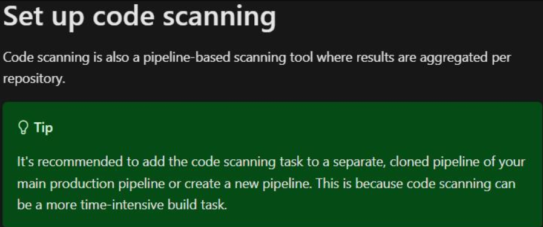
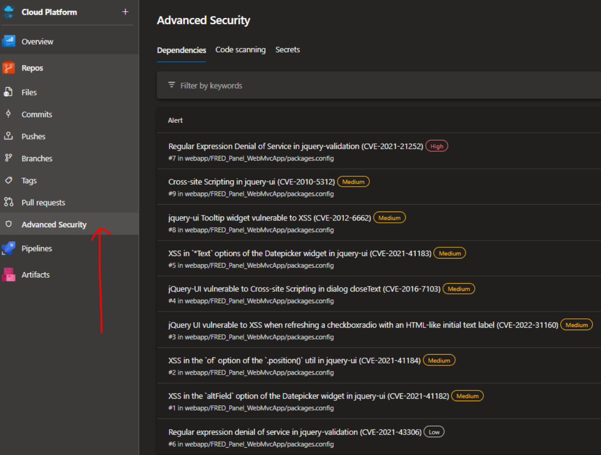

# Code Vulnerability Scanning

## Overview
[GitHub Advanced Security for Azure DevOps](https://learn.microsoft.com/en-us/azure/devops/repos/security/configure-github-advanced-security-features?view=azure-devops&tabs=yaml) provides a set of features for enhancing the security of code stored within Azure DevOps git repos:

- Secret scanning
- Push protection
- Dependency scanning
- Code scanning

This feature can be enabled on a repo-by-repo basis, although it does have an associated cost per developer.

Details about the feature can be found on the Microsoft site here: GitHub Advanced Security for Azure DevOps

## [Secret Scanning](https://learn.microsoft.com/en-us/azure/devops/repos/security/github-advanced-security-secret-scanning?view=azure-devops)
After Advanced Security has been enabled on a repo, Azure DevOps will start scanning for secrets across all branches and all history of that repo. Secret detection is based off a Microsoft algorithm and detects many of the most common type of secret found across public GitHub repos.

If any secret is detected, it will be displayed on the "Secrets" tab of the Advanced Security page. Clicking on each item will show you the exact part of the code containing the secret and the commit in which it was added. It will also provide a set of recommended remediation steps to remove the secret from the code.

If any secrets are detected, it is the responsibility of the product owner to ensure that:

a) The secret is removed from the repo.
b) The code is updated to read that secret is removed from a secure location (e.g. an Azure Key Vault).
c) The compromised secret is invalidated.

> **Note:** Simply removing the secret from the repo is not enough as it will remain available in plaintext within the git history. As such, any secret that was ever stored in a git repo should be assumed to be compromised and must be invalidated (e.g. the password rotated, or a new key generated etc.).

## [Push Protection](https://learn.microsoft.com/en-us/azure/devops/repos/security/github-advanced-security-secret-scanning?view=azure-devops#secret-push-protection)
If push protection was selected when enabling Advanced Security, Azure DevOps will immediately begin scanning incoming pushes for high-confidence secrets and, if found, will reject the push. This prevents new secrets from being added to the repo in the first place (saving it from having to be invalidated).

## [Dependency Scanning](https://learn.microsoft.com/en-us/azure/devops/repos/security/github-advanced-security-dependency-scanning?view=azure-devops)
The dependency scanning pipeline task scans the built code base for any dependencies that are known to contain vulnerabilities. This can include nuget packages, npm modules, maven packages, etc.

Dependency scanning is not automatically carried out as soon as you enable Advanced Security. You will first need to add the following step to your build pipeline:

```yaml
  # Dependancy scanning task
  - task: AdvancedSecurity-Dependency-Scanning@1
    displayName: 'Dependency Scan'
```

If any vulnerabilities are found, they will be shown on the "Dependencies" tab of the Advanced Security page. Clicking on each item will show a summary of the vulnerability within the package along with a recommendation of how to mitigate it.

- It is the responsibility of the product owner to ensure that the dependency scanning task is included in the build stages of all applicable pipelines.
- It is the responsibility of the development team to ensure that they do not approve any pull requests without first checking that the dependency scanning task has not found any critical or high vulnerabilities.

## [Code Scanning](https://learn.microsoft.com/en-us/azure/devops/repos/security/github-advanced-security-code-scanning?view=azure-devops)
Code scanning scans your code for any patterns that are known to be insecure. For example, if you had a line such as

```csharp
string s = "SELECT * FROM [table] WHERE [column] = " + variable
```
… it would flag that as potentially open to SQL injection attacks.

Code scanning is not automatically carried out as soon as you enable Advanced Security. You will first need to add the following steps to your build pipeline:

```yaml
  # Initialize CodeQL database
  - task: AdvancedSecurity-Codeql-Init@1
    inputs:
      languages: "csharp"
​
  # Build project using Autobuild (or use your own custom build steps)
  - task: AdvancedSecurity-Codeql-Autobuild@1
    displayName: 'Advanced Security Autobuild'
​
  # Run analysis
  - task: AdvancedSecurity-Codeql-Analyze@1
    displayName: 'Advanced Security Code Scanning'
```

If any vulnerabilities are found, they will be shown on the "Code scanning" tab on the Advanced Security page. Clicking on each item will show a summary of the vulnerability along with a recommendation of how to mitigate it.

Code scanning is much more resource intensive than dependency scanning. Microsoft recommends running it in a separate pipeline to avoid slowing down the normal CI/CD feedback loop.



However, despite running in a separate pipeline, it is still recommended you ensure this pipeline is successful before any PRs are allowed to be merged. You would do this by updating your branch protection policies to include both pipeline (CI & code scanning).

- It is the responsibility of the product owner to ensure that code scanning pipelines are created and that the branch policies are updated appropriately.
- It is the responsibility of the development team to ensure that they do not approve any pull requests without first checking that the code scanning task has not found any critical or high vulnerabilities.

## Scan Results
To see the results of any scan, navigate to "Repos" > "Advanced Security"

